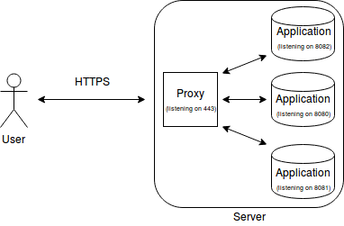

# HTTPS the easy way (with SSL/TLS offloading) 
If you're making an application for the web then you already know that you should be using HTTPS. If you're trying to add the encryption into your application then you're making life harder then it has to be. **Why wouldn't you just do SSL/TLS offloading and leave your application alone?**

_This article is to convince you why offloading is the best practise. For practical guide on how to setup HTTPS with your web application see my other post: [Make your web app use HTTPS in 30 minutes with Let's Encrypt and NGINX](/2018/01/20/Make-your-web-app-use-HTTPS-in-30-minutes)._

## Offloading encryption to a proxy
SSL/TLS offloading means having a proxy server between the client and your applciation. The proxy server is responsible for handling all the encryption/decryption and forwards everything on to your applications.

## Benefits

  * Eliminates the need to handle any encryption/decryption within your application and so allows you to focus your development time on making new features for your users.
  * HTTPS certificates only need to be configured for the proxy and not on all the backend applications.
  * Security patches for SSL/TLS only need to be applied to the proxy.

## Downsides to handling HTTPS in your application

  * Slows down development
  * Updating certificates is harder
  * You should have a proxy anyway

### Slows down development
It can be quite a lot of effort getting everyone on your development team setup with your development certficates. You have to configure your browsers to use them, you need to add exceptions to allow self-signed certificates and you also make life harder for yourself when you want to debug the packets being sent to and from your application. **Just run your application unencrypted** and offload the SSL/TLS to your proxy on your production environment.

### Updating certificates is harder
Imagine a security flaw is discovered in SSL/TLS and you need to upgrade. Wouldn't it be nice to just update the proxy, instead of having to go through each of your applications and update them in turn.

### You should have a proxy anyway
For your application to be listening for HTTP (port 80) or HTTPS (port 443) it would require root priviledges. We all know that [you shouldn't be running your application with root priviledges](http://bencane.com/2012/02/20/why-you-should-avoid-running-applications-as-root/) so you should have already been using a proxy to forward the packets to your application. Changing your proxy to use HTTPS is easy, so why bothing making the changes in all of your applications.

Having something like nginx in front of your applications gives you a whole lot more then just the HTTPS. You also get load balancing, content cache, and monitorring. These are the added bonuses of using a proxy.

## Not convinced?
Raise an [issue on my GitHub page](https://github.com/calum/calum.github.io/issues) with any questions you have.

[Home](/)
